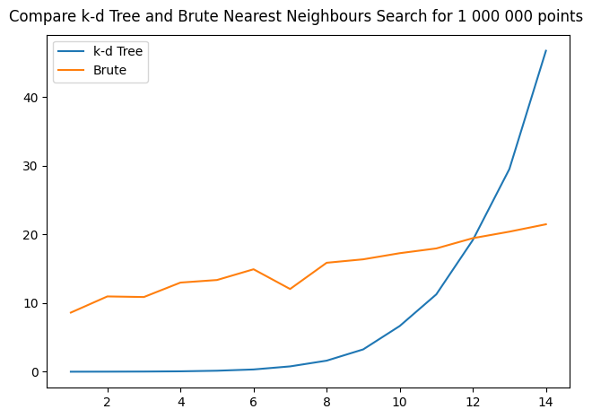

# kdtree
<br>Demonstrates how to implement and use a C++ template of a k-d tree.

**Run the demo**
<p>This demo can be build for Windows and Linus.

**Windows**
<p>Just open the solution KD.sln with Visual Studio.

**Linux**
<p> g++ main.cpp -o kdtree


# Introduction
<br><br>The <b>k-d tree</b> is a variant of <b>binary tree</b> in which every node contains a k-dimensional point and has a splitting hyperplane that divides the space into two parts. Hypeplane direction is selected to rotate along the d-dimensions. For full explanation [see](https://en.wikipedia.org/wiki/K-d_tree) . 

The <b>k-d tree</b> can be used for many problems with low dimensional data (d < 10), it allows some balancing techniques and effectibe Nearest-Neighbours search, which makes it useful even for 3D and 2D (for other spatial trees like OcTree balancing and nearest-neighbours search is even more challenging). Here I have demonstrated how  a Nearest-Neighbours search with can be efficiently organized. 


# Implementation of KdTree template in C++

The building block of the <b>k-d tree</b> is the <b>KdNode</b> , like any Binary Tree it must have pointers to a <b>Left</b> and <b>Right</b> subtrees. It also has <b>axis</b> which contains the rotating split dimension of the node:


```cpp
class KDNode
{
    friend class KDTree;
    public:
        KDNode(const T* x, int n, int axis);
        const T* data() const { return x.data(); }
        unsigned int getId() const { return id;  }

    protected:
        KDNode* parent ;
        KDNode* left ;
        KDNode* right ;        
        
        int axis ;
        std::vector<T> x;
        unsigned int id ;
        bool checked ;
};
```

Here is a brief explation of each of the KdNode members:
- <b>left, right</b>  - pointers to the left and right subtrees
- <b>parent</b>  - pointer to parent node
- <b>axis</b>  - index of the split axis (can be in the range 0-d)
- <b>x</b> - array with d-dimensional data point
- <b>id</b> - id of the point used during the tests
- <b>checked</b> - used during the nearest neighbours search


This is the full definition of the <b>k-d tree</b> template:


```cpp
template <typename T>
class KDTree
{
public:
    KDNode*  root ;
    KDTree(unsigned int K, unsigned int D);
    ~KDTree();
    bool            add(const T* x);
    KDNode*         insert(const T* x) ;
    KDNode*         find_exact(const T* x) ;
    KDNode*         find_nearest(const T* x);
    KDNode*         find_nearest_brute(const T* x) ;
    KDNode*         find_exact_brute(const T* x);
    KDNode*         find_parent(const T* x) ;
    void            clear();
    size_t          size() const { return NodesList.size();  };
    size_t          numChecked() const { return NodesChecked.size();  };
    
public:
    T               d_min ;   
    unsigned int    n_dim;

protected:  
    void                    check_subtree(KDNode* node, const T* x);
    void                    set_bounding_cube(KDNode* node, const T* x);
    KDNode*                 search_parent(KDNode* parent, const T* x);
    void                    uncheck();

    KDNode*                 nearest_neighbour ;
    int                     KD_id  ;
    std::vector<KDNode*>    NodesList ;
    std::vector<KDNode*>    NodesChecked ;
    std::vector<T>          x_min, x_max; 
    std::vector<bool>       max_boundary, min_boundary;
    int                     n_boundary ;
};
```

See: 
<br>
[KDTree.h](Sources/KDTree.h) 
<br>


# Nearest Neighbours Search

Typical Output of the benchmark application is:

```
KD Tree Created!
Points number:          1000000
Tree Nodes:             1000000
Space Dimension:        10
Creation Time [ms]:     931.431030
Test points:            100

Nearest Neighbours Search
------------------------------------------------
avr. kd NN time [ms]               2.086340
avr. kd exact time [ms]            0.001490
avr. brute NN time [ms]            9.103150
avr. brute exact time [ms]         5.639280
kd/brute NN ratio:                 4.363215
kd/brute exact ratio:              3784.751465
Errors:                            0
```


# Benchmark comparison

The figure below shows the comparison of the NN search with k-d tree and the brute NN search:

<p align="center">
  
</p>

These results shows that as can be expected the <b>Brute NN</b> search performance increases linearly with the data dimension O(d), while the <b>k-d</b> NN search performanceis is deteriorating exponentially and after d=10 it is closing to the results obtained with <b>Brute NN</b>. This is another effect of the 
[<b>Curse of dimensionality</b>,](https://en.wikipedia.org/wiki/Curse_of_dimensionality), valid for many algorithms working with for <b>high dimensional</b> data.


